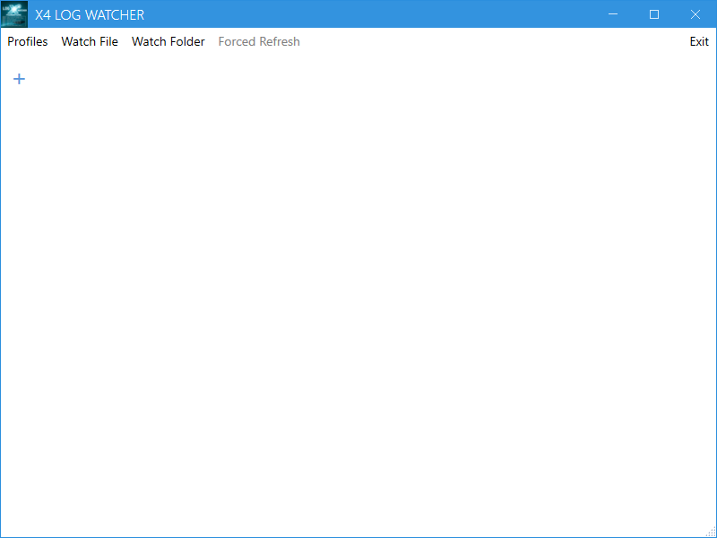
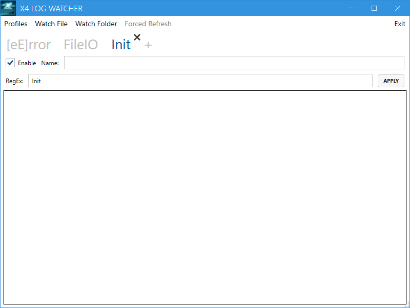
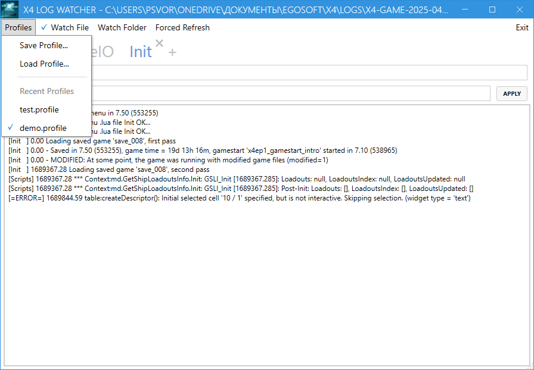
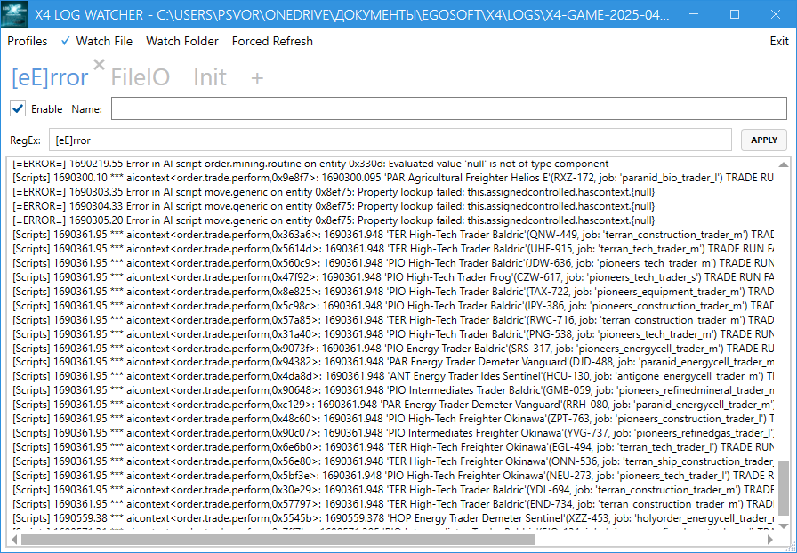
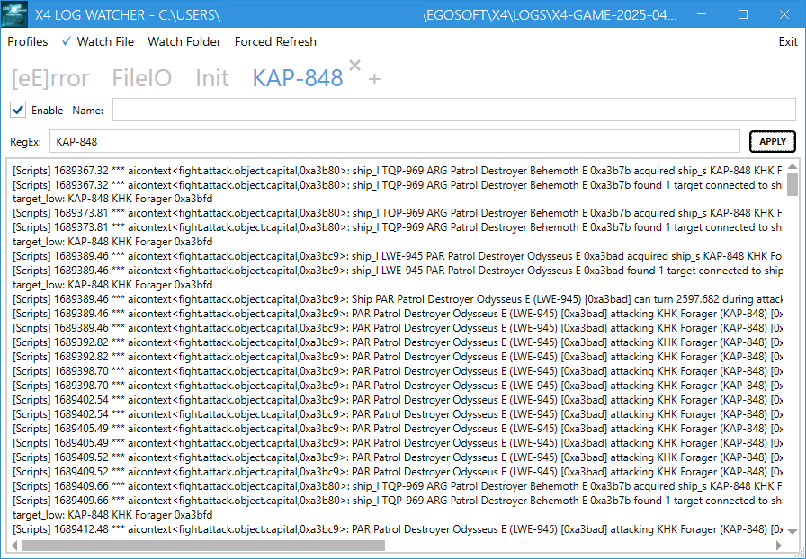
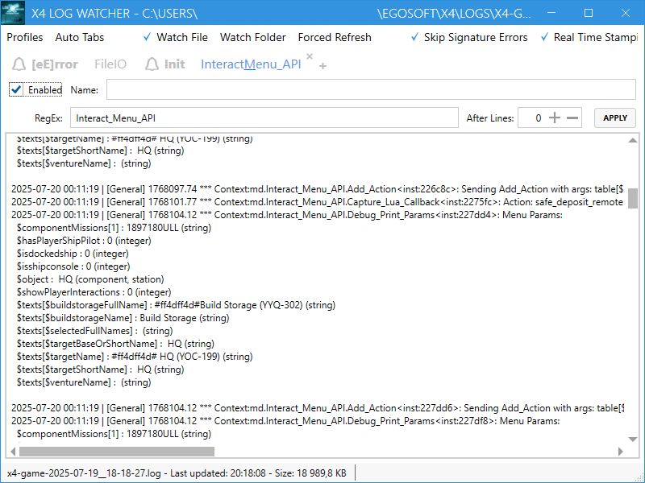
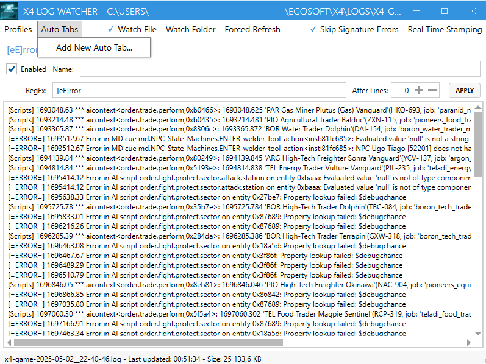
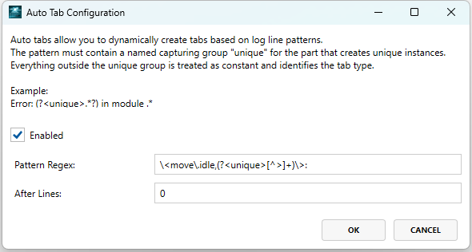
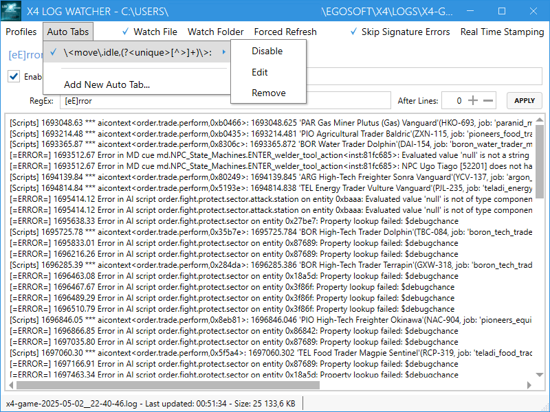
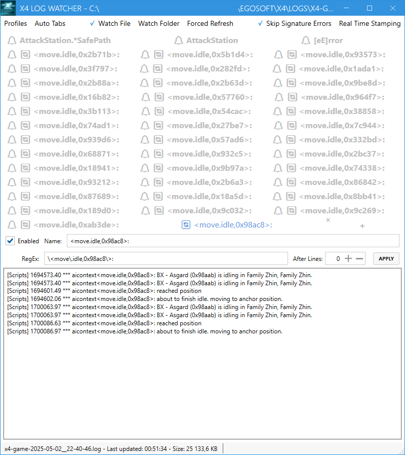

# X4 Log Watcher

X4 Log Watcher is a simple tool to monitor the log files of X4: Foundations. It provides a graphical interface to view and filter log entries, making it easier to analyze the game's output.

## Features

- Real-time log monitoring
- Filter log entries by regular expressions
- Multi-tabbed interface for filtering the same log file
- Enable/disable filters on the fly per each tab
- Watch not only the exact log file but also the parent directory to reload the log file when new log files are created
- Support profiles saving and loading - i.e. current tabs with filters
- Offline mode - i.e. load the log file from disk and parse it
- Loading default profile on startup
- Support a "Forced refresh" mode, if by some reason standard Windows file watcher doesn't work
- Support simple text search in current filtered content via Ctrl+F and F3(Enter)/Shift+F3 for next/previous search result
- Has a status bar with the current log file name and it's stats. Additionally shows the loading progress of the log file in the offline mode
- Shows the updates in non-focused tabs via "bolding" and adding the notification symbol "🔔" to the tab name
- Extension for the log file is configurable via editing of the config file. By default, it is set to `.log`
- Has option to skip the signature related errors in the log file. By default, it is set to `true`
- Has option to add "real" timestamp to the filtered content. By default, it is set to `false`
- Supports AutoTabs feature - automatically create tabs based on the appropriate regex pattern from log file content
- Supports multi-lined log entries, allowing the tool to handle log entries that span multiple lines

## Requirements

Windows 10 or later

## Installation

Simply download a `X4LogWatcher.zip` file from:

- Nexus Mods [X4 Log Watcher](https://www.nexusmods.com/x4foundations/mods/1669)
- GitHub [Releases page](https://github.com/chemodun/x4logwatcher/releases).

And then extract it to your desired location. Then, run the executable to start the application.

## Important Note

Please ensure that you started the X4 with appropriate command line switches to produce a log files.
Details on how to do this can be found in the [HOWTO - Hacking X4 Foundations](https://wiki.egosoft.com:1337/X4%20Foundations%20Wiki/Modding%20Support/ScriptingMD/Community%20Guides/h2odragon%27s%20HOWTO-hackx4f/#debug-log)

**Notice:** Please set the extension for the debug log to `.log`!

## Usage

To use X4 Log Watcher, follow these steps:

- Launch the application.



- Use the filtering options to customize the log entries displayed.



- Save your profile for future sessions.



- Select the log file you want to monitor or choose a directory to watch.




## Multi-lined log entries

The tool can now handle log entries that span multiple lines, making it easier to read and analyze complex log messages. Regex patterns can be applied to only the first line of the multi-lined entry. Same rule is applied to the AutoTabs and TimeStamping features.



## AutoTabs feature

From version 0.6.0 onwards, the application supports the AutoTabs feature. This feature allows you to automatically create tabs based on the log file content. The application will analyze the log file and create tabs for each unique entry, making it easier to monitor multiple entries simultaneously.

The key point of it - the regular expression pattern with mandatory named group `unique`. The tool will check the log lines against this pattern and create tabs for each unique match.

Let's assume we need an AutoTabs for the `move.idle` script.
Log line looks like this:

```log
[Scripts] 1689391.54 *** aicontext<move.idle,0x75840>: about to finish idle. moving to anchor position.
```

In this case the regex pattern will look like `\<move\.idle,(?<unique>[^>]+)\>:`.






Tool will create tabs for each unique value of the `unique` group. The tabs will be named according to the full regex pattern with prefix "🔄", so in this case the tab name will be `🔄 <move.idle,0x75840>`.



But you are not limited to one script. For example, if needed to monitor all command with `move.` prefix, the regex pattern will look like `\<move\.[^,]+,(?<unique2>[^>]+)\>:`. And all log lines with `move.` prefix will be split into separate tabs, per ship object id.

## Known Issues

In some cases, the application may not detect changes in the log file. If this happens, you can enable the "Forced refresh" mode in the menu. This will force the application to check for changes in the log file at regular intervals.

Will work in case if any `watch mode` is enabled.

In some cases too many tabs can fill a whole window of a tool. There is limitation of used framework. Let's limit an AutoTabs feature in this case.

## Links

- A short demo showcasing the tool features introduced in version 0.2.0: [X4 Log Watcher Demo](https://youtube.com/watch?v=6cPAfx4gxTA).
- A short demo showcasing the new features introduced in version 0.3.0: [X4 Log Watcher Demo - Version 0.3.0](https://youtube.com/watch?v=wRRwymDHv1g).
- A short demo showcasing the new features introduced in version 0.4.0: [X4 Log Watcher Demo - Version 0.4.0](https://youtube.com/watch?v=1LO7Upyd3ZM).
- A short demo showcasing the new features introduced in version 0.6.0: [X4 Log Watcher Demo - Version 0.6.0](https://youtube.com/watch?v=a77PBN25-jo).
- There is a topic on the [Egosoft forum](https://forum.egosoft.com/viewtopic.php?t=470624), related to this tool.

## Changelog

### [0.8.0] - 2025-07-20

- Added:
  - Support for the multi-lined log entries. Now the tool can handle log entries that span multiple lines, making it easier to read and analyze complex log messages. Regex patterns can be applied to only the first line of the multi-lined entry.

### [0.7.1] - 2025-06-12

- Changed:
  - Unify processing changes in the log file for both "standard" and forced refresh modes.

### [0.7.0] - 2025-06-12

- Fixed:
  - Possible memory leaks (Thanks to [toshibdib](https://next.nexusmods.com/profile/shibdib) for the report)
  - Focus shift on newly created AutoTab
  - On update a tab the position is always set to the end of the content

### [0.6.0] - 2025-04-13

- Added:
  - AutoTabs feature - automatically create tabs based on the appropriate regex pattern from log file content.

- Changed:
  - Font size of the tabs slightly decreased. To cover the AutoTabs feature.

### [0.5.0] - 2025-04-12

- Added:
  - Option to skip the signature related errors in the log file. By default, it is set to `true`.
  - Option to add "real" timestamp to the filtered content. By default, it is set to `false`.
  - "Bolding" of the tab name, if the tab is not focused and there are new updates in it.

- Changed:
  - Font size of the tabs slightly decreased.

### [0.4.1] - 2025-04-11

- Added:
  - Notification symbol "🔔" to the tab name, if the tab is not focused and there are new updates in it.
  - Show up to 10 lines after the matched line in the log file. Useful for showing the error details in the scripts.
  - Support for configurable log file extensions in the application settings.

- Fixed:
  - "Tab" order of input elements in the filter form.
  - Wrong regex is used after editing the filter and Enabling the Tab
  - Extra content cleanup after pausing the Tab

### [0.3.0] - 2025-04-09

- Added:
  - Search in current filtered content via Ctrl+F and F3(Enter)/Shift+F3 for next/previous search result.
  - Status bar with the current log file name and its stats.
  - Loading progress of the log file in offline mode.

- Improved:
  - Performance - file changes now loaded once then filtered per each tab.

### [0.2.0] - 2025-04-08

- Initial public release.

## Contributing

Contributions are welcome! If you have suggestions for improvements or new features, please open an issue or submit a pull request.

## License

This project is licensed under the Apache License 2.0. See the [LICENSE](LICENSE) file for details.
