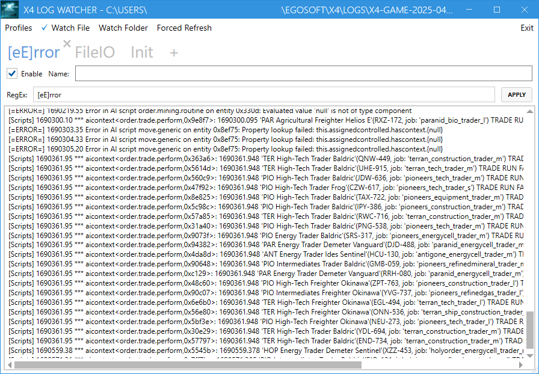

# X4 Log Watcher

X4 Log Watcher is a simple tool to monitor the log files of X4: Foundations. It provides a graphical interface to view and filter log entries, making it easier to analyze the game's output.

## Features

- Real-time log monitoring
- Filter log entries by regular expressions
- Multi-tabbed interface for filtering the same log file
- Enable/disable filters on the fly per each tab
- Watch not only the exact log file but also the parent directory to reload the log file when new log files are created
- Support profiles saving and loading - i.e. current tabs with filters
- Offline mode - i.e. load the log file from disk and parse it
- Loading default profile on startup
- Support a "Forced refresh" mode, if by some reason standard Windows file watcher doesn't work
- Support simple text search in current filtered content via Ctrl+F and F3(Enter)/Shift+F3 for next/previous search result
- Has a status bar with the current log file name and it's stats. Additionally shows the loading progress of the log file in the offline mode
- Shows the updates in non-focused tabs via adding the notification symbol "🔔" to the tab name
- Can show up to 10 lines after the matched line in the log file. Useful for showing the error details in the scripts
- Extension for the log file is configurable via editing of the config file. By default, it is set to `.log`

## Requirements

Windows 10 or later

## Installation

Simply download a `X4LogWatcher.zip` file from:

- Nexus Mods [X4 Log Watcher](https://www.nexusmods.com/x4foundations/mods/1669)
- GitHub [Releases page](https://github.com/chemodun/x4logwatcher/releases).

And then extract it to your desired location. Then, run the executable to start the application.

## Important Note

Please ensure that you started the X4 with appropriate command line switches to produce a log files.
Details on how to do this can be found in the [HOWTO - Hacking X4 Foundations](https://wiki.egosoft.com:1337/X4%20Foundations%20Wiki/Modding%20Support/ScriptingMD/Community%20Guides/h2odragon%27s%20HOWTO-hackx4f/#debug-log)

**Notice:** Please set the extension for the debug log to `.log`!

## Usage

To use X4 Log Watcher, follow these steps:

- Launch the application.

- Use the filtering options to customize the log entries displayed.

- Save your profile for future sessions.

- Select the log file you want to monitor or choose a directory to watch.

## Known Issues

In some cases, the application may not detect changes in the log file. If this happens, you can enable the "Forced refresh" mode in the menu. This will force the application to check for changes in the log file at regular intervals.

Will work in case if any `watch mode` is enabled.

## Links

- A short demo showcasing the tool features introduced in version 0.2.0: [X4 Log Watcher Demo](https://youtube.com/watch?v=6cPAfx4gxTA).
- A short demo showcasing the new features introduced in version 0.3.0: [X4 Log Watcher Demo - Version 0.3.0](https://youtube.com/watch?v=wRRwymDHv1g).
- A short demo showcasing the new features introduced in version 0.4.0: [X4 Log Watcher Demo - Version 0.4.0](https://youtube.com/watch?v=1LO7Upyd3ZM).
- There is a topic on the [Egosoft forum](https://forum.egosoft.com/viewtopic.php?t=470624), related to this tool.

## Changelog

### [0.4.0] - 2025-04-11

- Added:
  - Notification symbol "🔔" to the tab name, if the tab is not focused and there are new updates in it.
  - Show up to 10 lines after the matched line in the log file. Useful for showing the error details in the scripts.
  - Support for configurable log file extensions in the application settings.

- Fixed:
  - "Tab" order of input elements in the filter form.

### [0.3.0] - 2025-04-09

- Added:
  - Search in current filtered content via Ctrl+F and F3(Enter)/Shift+F3 for next/previous search result.
  - Status bar with the current log file name and its stats.
  - Loading progress of the log file in offline mode.

- Improved:
  - Performance - file changes now loaded once then filtered per each tab.

### [0.2.0] - 2025-04-08

- Initial public release.

## Contributing

Contributions are welcome! If you have suggestions for improvements or new features, please open an issue or submit a pull request.

## License

This project is licensed under the Apache License 2.0. See the [LICENSE](LICENSE) file for details.
