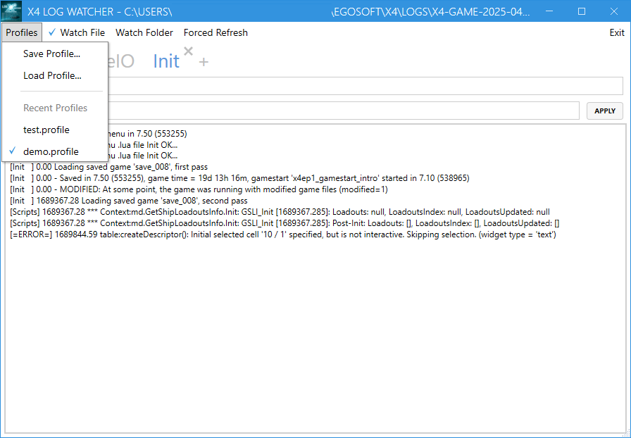

# X4 Log Watcher

X4 Log Watcher is a simple tool to monitor the log files of X4: Foundations. It provides a graphical interface to view and filter log entries, making it easier to analyze the game's output.

## Features

- Real-time log monitoring
- Filter log entries by regular expressions
- Multi-tabbed interface for filtering the same log file
- Enable/disable filters on the fly per each tab
- Watch not only the exact log file but also the parent directory to reload the log file when new log files are created
- Support profiles saving and loading - i.e. current tabs with filters
- Offline mode - i.e. load the log file from disk and parse it
- Loading default profile on startup
- Support a "Forced refresh" mode, if by some reason standard Windows file watcher doesn't work

## Requirements

Windows 10 or later

## Installation

Simple download a `X4LogWatcher.zip` file from the [Releases page](https://github.com/chemodun/x4logwatcher/releases) and extract it to your desired location. Then, run the executable to start the application.

## Usage

To use X4 Log Watcher, follow these steps:

- Launch the application.

- Use the filtering options to customize the log entries displayed.

- Save your profile for future sessions.

- Select the log file you want to monitor or choose a directory to watch.

## Known Issues

In some cases, the application may not detect changes in the log file. If this happens, you can enable the "Forced refresh" mode in the menu. This will force the application to check for changes in the log file at regular intervals.

Will work in case if any `watch mode` is enabled.

## Links

Short demo video on YouTube: [X4 Log Watcher Demo](https://youtube.com/watch?v=6cPAfx4gxTA).

## Contributing

Contributions are welcome! If you have suggestions for improvements or new features, please open an issue or submit a pull request.

## License

This project is licensed under the Apache License 2.0. See the [LICENSE](LICENSE) file for details.
